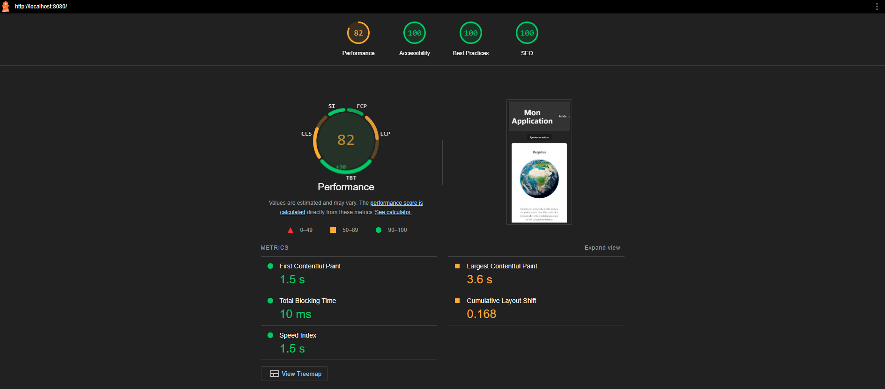

# GreenIt
L'objectif de ce projet est de développer une application web en adoptant les principes de l'écoconception, en optimisant la consommation de ressources et en minimisant l'impact environnemental à chaque étape du développement.
## Choix d’écoconception

### Backend
- **Fastify :** Framework minimaliste et performant permettant une consommation énergétique réduite et une gestion efficace des requêtes.

- **Sharp :** Permet de servir des images allégées et de réduire les coûts en ressources.

- **PostgreSQL :** Eviter la redondance et minimiser l’utilisation des ressources.

- **CORS et fichiers statiques via Fastify :** Optimisation des requêtes et amélioration de la rapidité de réponse.

### Frontend

- **Vue.js :** Framework performant offrant un rendu efficace en optimisant la consommation de ressources.

- **Vite :** Outil de build rapide et efficace en termes de consommation de ressources, permet de minimiser la charge lors du développement.

- **Ky :** Optimise les requêtes HTTP pour les rendre plus légères et efficaces.

- **Lazy Load :** Permet de ne charger que les images visibles à l’écran, réduisant ainsi la consommation de ressources.

- **LightHouse** : Outil d'audit de performance, permet de vérifier la performance et l'accessibilité du site.



## Ce que je n'ai pas eu le temps de faire
- **Optimisation des images** : 
Actuellement, les images peuvent être trop grandes pour les appareils mobiles, entraînant une consommation excessive de données et des temps de chargement plus longs.

- **Comment faire** : Servir des images redimensionnées et adaptées, générer différentes versions des images pour les adapter aux différents appareils

- **Mettre en place des Tests :** Faciliter la maintenance et la détection des erreurs.

- **Apache Vhost :**  Désactiver le AllowOverride pour bloquer la réécriture
de surcharger des directives du serveur web

## Actions à venir

### Mise en production (MEP)
- **Optimisation des assets :**  Minification des fichiers  

- **Mise en place d'un CDN :** Distribuer les fichiers statiques via des serveurs proches des utilisateurs,

- **Cache efficace :** Utiliser le cache pour stocker les données fréquemment utilisées

- **HTTP2 :** Améliorer la vitesse de chargement des pages. Gestion plus efficace des connexions réseau. Réduit les délais de latence et les ressources nécessaires pour chaque requête.

#### Serveurs et infrastructure 
- **Déploiement sur un hébergeur éco-responsable :** PlanetHoster
PlanetHoster a une politique de réduction de l'empreinte carbone et utilise des énergies renouvelables pour alimenter ses centres de données. Possède des serveurs en France. 

### Gouvernance
- **Objectifs de réduction des émissions de CO2 :** 
 Un objectif annuel de réduction des émissions de CO2 associées à l'infrastructure et au développement.

- **Sensibilisation à l'écoconception :**
  Se former et former les personnes aux principes de l'écoconception et à l'optimisation des ressources tout au long du cycle de vie d'une application. 


- **Réduction de l’empreinte carbone des déplacements :**
  Encourager le télétravail, pour limiter l’impact environnemental des déplacements.


## Démarrage

## Docker compose
### Créer l'image
```bash
docker-compose build
```
### Démarrer les conteneurs
```bash
docker-compose up
```
## ⚠️ **Warning :**
Actuellement l'api n'est pas Dockeriser pour lancer l'api faire ``npm run dev`` dans le dossier api.


